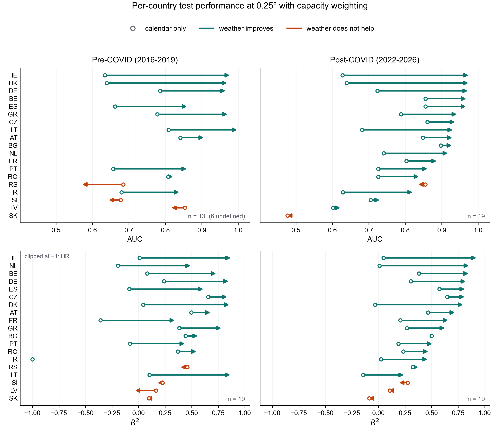
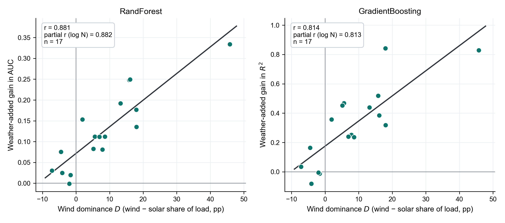
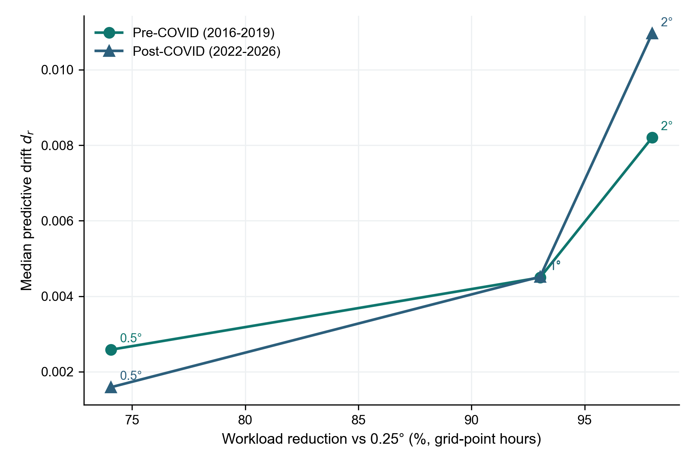

<!-- README for the weather-informed-modeling repository -->

# Weather-Informed Modeling of Renewable Electricity Share in Europe

### Effects of Renewable Mix and Spatial Resolution

This repository contains the pipeline, derived result tables, and figures behind a study of how much **ERA5 weather** adds to predictions of hourly renewable generation as a **share of national electricity load**, across **19 European power systems**. It isolates the weather contribution against a calendar-only baseline, and compares **installed-capacity-weighted** against **uniform** spatial aggregation at grid resolutions from **0.25° to 2°**.

> **Headline result.** *Where* you sample weather matters more than *how finely*. Weighting grid cells toward mapped wind and solar farms beats uniform averaging in **55 of 64** classification and **65 of 76** continuous comparisons, while coarsening the grid from 0.25° to 1° removes **93% of the grid-point hours** for a median drift of **0.0045** — about 4% of the effect being measured. National-scale models can be built at roughly a fourteenth of the spatial data volume, provided the weather is weighted by capacity rather than averaged across the map.

---

## Authors

| Author | Affiliation |
|---|---|
| Aiden Wang | BU Rise Lab, Boston University |
| Rashanjot Kaur (corresponding — rashan@bu.edu) | MET Dept. of Computer Science, Boston University |
| Eugene Pinsky | MET Dept. of Computer Science, Boston University |

Submitted to *Forecasting* (MDPI), 2026.

---

## Why this matters

Power systems with a lot of wind and solar need to know what fraction of demand renewables will cover each hour, and that fraction is driven largely by weather. But gridded weather is expensive to acquire, store, and process, and it is not obvious how much of it a national model actually needs.

1. **A calendar baseline is a real competitor.** Hour, month, and weekend already explain much of the variation. The value of weather has to be measured *against* that baseline, not in absolute accuracy.
2. **Uniform averaging dilutes the signal.** Wind speed over terrain with no turbines carries no information about generation; wind speed at a wind farm carries most of it.
3. **Resolution is the wrong lever to pull first.** Coarsening the grid is nearly free in accuracy terms. Getting facility locations right is not.

---

## What is measured

Renewable share of load, and the gain from adding weather to a calendar baseline:

$$Y_t = 100 \times \frac{R_t}{L_t} \qquad Z_t = \mathbb{1}[\,Y_t > 50\,]$$

$$U_t = \frac{1}{N_r}\sum_{g=1}^{N_r} X_{g,t} \qquad C_t = \frac{\sum_g w_g(y)\,X_{g,t}}{\sum_g w_g(y)}$$

$$\Delta = S_1 - S_0 \qquad D = \mathrm{WindShare} - \mathrm{SolarShare}$$

| Term | Meaning |
|---|---|
| $Y_t$ / $Z_t$ | Renewable share of load (%) / indicator that it exceeds 50% |
| $U_t$ / $C_t$ | National weather value under uniform vs. capacity weighting |
| $w_g(y)$ | Active wind or solar capacity in grid cell $g$ during year $y$ |
| $\Delta$ | **Weather-added gain** — calendar+weather score minus calendar-only score |
| $D$ | **Wind dominance** — wind share of load minus solar share, in percentage points |
| $d_r$ | **Predictive drift** — $\lvert \Delta_r - \Delta_{0.25} \rvert$ at coarser resolution $r$ |

---

## Key inputs

| Input | Value | Source |
|---|---|---|
| Countries | 19 European systems | joint data availability, fixed before evaluation |
| Periods | 2016–2019 (pre-COVID), 2022–Apr 2026 (post-COVID) | 2020–21 treated as a transition |
| Target | `Renewable_share_of_load`, hourly | Energy-Charts API |
| Weather | 100 m wind speed, surface solar radiation, 2 m temperature | ERA5, native 0.25° |
| Resolutions | 0.25°, 0.5°, 1°, 2° | block-mean coarsening |
| Capacity weights | operating wind and solar phases, by year | GEM trackers, February 2026 release |
| Models | Random Forest, LightGBM, gradient boosting, logistic regression | fixed settings, seed 42 |
| Split | chronological 80/20, no shuffling | per country and period |

---

## Results

### Weather substantially improves accuracy

At 0.25° with capacity weighting, medians across countries:

| Era | Task | Model | *n* | Calendar | Cal.+weather | Median Δ | Δ > 0 |
|---|---|---|---:|---:|---:|---:|---:|
| Pre-COVID | Classification (AUC) | Random Forest | 13 | 0.684 | 0.860 | **+0.180** | 10/13 |
| Pre-COVID | Regression (R²) | Gradient Boosting | 19 | 0.102 | 0.558 | **+0.507** | 15/19 |
| Post-COVID | Classification (AUC) | Random Forest | 19 | 0.726 | 0.928 | **+0.112** | 17/19 |
| Post-COVID | Regression (R²) | Gradient Boosting | 19 | 0.233 | 0.625 | **+0.319** | 16/19 |

<p align="center"></p>
<p align="center"><em>Per-country test performance at 0.25° with capacity weighting. Grey is the calendar-only baseline, teal adds weather. AUC above, R² below; countries ordered by calendar-plus-weather score.</em></p>

### The gain concentrates in wind-dominant systems

Post-COVID, weather-added gain tracks wind dominance across countries — and the relationship is not a proxy for how much weather data a large country contributes.

| Model | Metric | *r* | Partial *r* given log grid cells |
|---|---|---:|---:|
| Random Forest | AUC gain | **0.881** | 0.882 |
| LogReg | AUC gain | 0.850 | 0.853 |
| Gradient Boosting | R² gain | **0.814** | 0.813 |
| LightGBM | R² gain | 0.809 | 0.809 |

Leave-one-country-out *r* never falls below **0.770**; Denmark is the most influential single system, and omitting Lithuania slightly *raises* the correlation.

<p align="center"></p>
<p align="center"><em>Wind dominance D against weather-added gain Δ, post-COVID. Each point is one country; annotations give the unadjusted and domain-size-adjusted correlations.</em></p>

### Coarser grids preserve the conclusion

Post-COVID, relative to the 0.25° capacity-weighted reference:

| Resolution | Grid-point hours | Workload cut | Median *d<sub>r</sub>* | Max *d<sub>r</sub>* |
|---|---:|---:|---:|---:|
| 0.5° | 129,578,760 | 74.1% | 0.0016 | 0.0249 |
| 1° | 34,832,592 | **93.0%** | **0.0045** | 0.0791 |
| 2° | 10,093,104 | 98.0% | 0.0110 | 0.1668 |

Against a post-COVID median gain of 0.112 AUC and 0.319 R², a 1° drift of 0.0045 is roughly **4%** and **1.4%** of the effect being measured. Maximum drift exceeds median drift by an order of magnitude at every resolution, so a minority of systems are genuinely sensitive to coarsening even where the typical system is not.

<p align="center"></p>
<p align="center"><em>Median predictive drift against spatial workload reduction. Points labelled by resolution.</em></p>

### Capacity weighting beats uniform averaging

Pooling both eras and all models, matched by country, era, task, and model at 0.25°:

| Task | *n* | Mean paired difference | Capacity wins | Wilcoxon *p* |
|---|---:|---:|---:|---:|
| Classification | 64 | +0.017 AUC | **55/64** | 1.1 × 10⁻⁹ |
| Regression | 76 | +0.046 R² | **65/76** | 4.3 × 10⁻¹⁰ |

---

## Reproducing the analysis

```bash
# 1. Environment
pip install -r requirements.txt
cp .env.example .env          # add CDSAPI_KEY, or use ~/.cdsapirc

# 2. Fetch inputs (Energy-Charts is open; ERA5 needs the key above;
#    the GEM workbooks are downloaded manually — see the script docstring)
python scripts/fetch_era_energy_inputs.py
python scripts/import_gem_capacity.py
python scripts/stage_era5_arco.py
python scripts/prepare_era5_resolution_cache.py

# 3. Run the ladder across eras, then aggregate
python scripts/run_era_spatial_resolution.py
python scripts/compare_era_spatial_resolution.py
```

Every number and figure in the paper is reproduced by the tables already committed under `results/paper/`, so the claims can be checked without re-running the pipeline — which needs roughly 20 GB of ERA5 and a Copernicus token.

---

## Repository structure

```
weather-informed-modeling/
├── weather_informed/          # shared library imported by scripts/
│   ├── regions.py             #   country codes, names, bounding boxes
│   ├── weather_build.py       #   ERA5 coarsening + capacity/uniform aggregation
│   ├── evaluate.py            #   calendar vs. calendar+weather fitting and gain
│   └── plotting_style.py      #   shared matplotlib rcParams
├── scripts/                   # single-purpose pipeline steps, run in the order above
├── notebooks/                 # annotated walkthroughs of the same pipeline
├── results/paper/             # the tables every reported number comes from
├── figures/paper/             # the three figures in the Results section
├── CITATION.cff
├── requirements.txt
└── .env.example
```

---

## Data sources

| Source | What it provides | Access |
|---|---|---|
| [Energy-Charts](https://www.energy-charts.info) (Fraunhofer ISE) | hourly generation, load, renewable share | public API, no key |
| [ERA5](https://doi.org/10.24381/cds.adbb2d47) (Copernicus C3S) | hourly wind, solar radiation, temperature | free Copernicus token |
| [Global Wind Power Tracker](https://globalenergymonitor.org/projects/global-wind-power-tracker/) / [Solar](https://globalenergymonitor.org/projects/global-solar-power-tracker/) (GEM) | facility locations and capacity | manual workbook download |

Raw inputs are **not** redistributed here. Each is public and obtainable without special permission, and the retrieval step for each is scripted.

---

## Citation

See `CITATION.cff` — GitHub renders it as a "Cite this repository" button, and `cffconvert` turns it into BibTeX. The preferred citation is the paper rather than the repository.

---

## License

No license file is present yet, so reuse terms are currently undefined. `CITATION.cff` omits a `license:` field until one is chosen.
